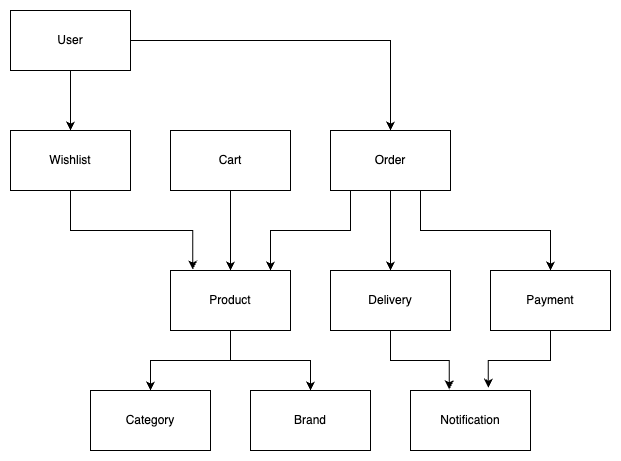

# E-commerce project
Showcase of spring boot monolith project.

## Warning
This project may contain imperfect code and is not intended for production use.
This project aims to create a simple but larger project to be analyzed
for the automatic decomposition of monolith to microservices. That means that the
actual correctness of functionality is less important than the overall structure and
static or dynamic calls between components.

### Imperfections
- **The project is not intended to be a reference implementation.**
- The project has no automated tests.
- The project has no error handling.
- There is no real database.
- The project is not optimized for performance.
- The project is not optimized for security.
- It may contain bugs.
- It may return unexpected results.
- Resource mappings or code in this project may drift away from conventions.
- This project is not intended for production use.

## Entity relationships

## CONTRIBUTING
In case you are interested in enhancing or adding new features to better mirror real monolith,
feel free to open a pull request or fork the project.
